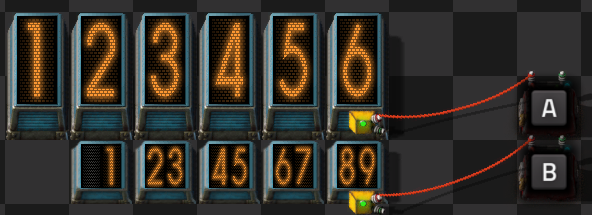
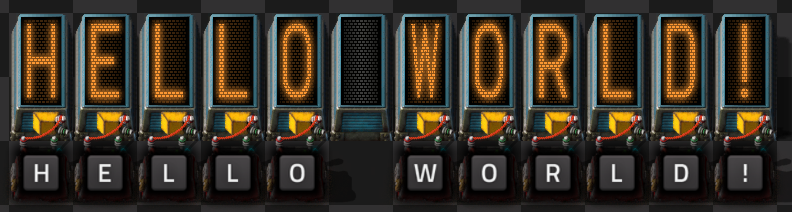
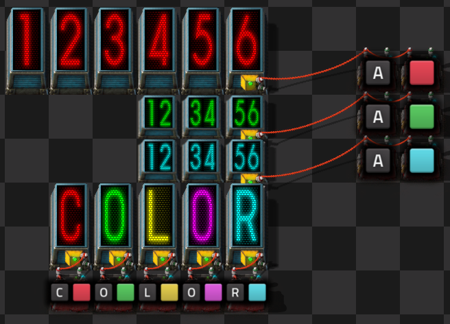
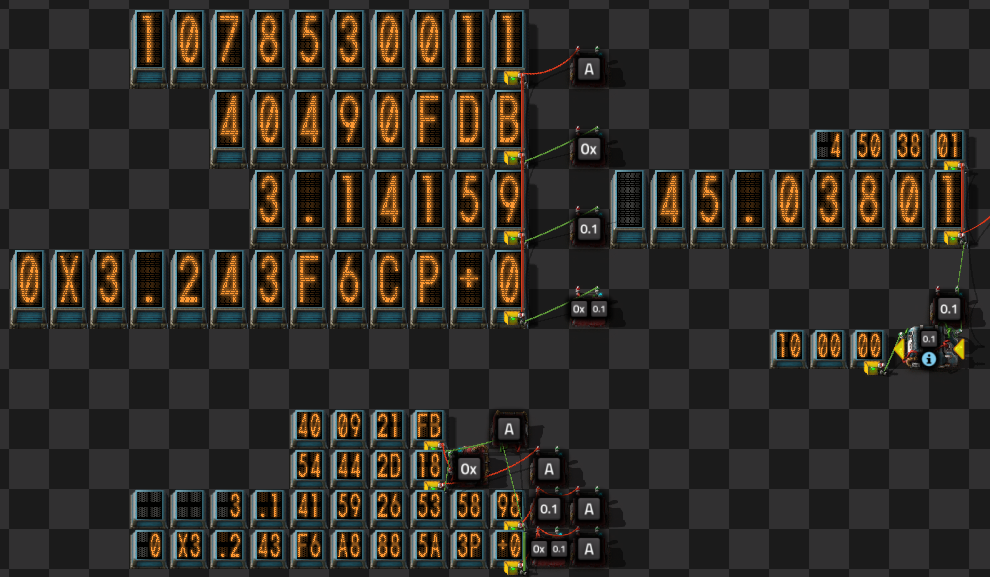

# nixie-tubes

Nixie tubes for display of circuit values.

  

Numeric nixies come in two sizes will link to the same size if they are side by side, and display the value configured in the condition of the rightmost digit. The condition itself is forced to an always-on condition.

Alpha Nixies ignore the condition and will display the characters associated with letter, number, and symbol virtual signals.

Circuit controlled colors are also supported, if "use colors" is selected, with all the same modes as vanilla lamps

Various alternate display modes are also available for numbers, selected by `signal-hex` and `signal-number-type`. `signal-hex` switches the display from decimal to hexadecimal for all number types. `signal-number-type` selects a number format:

| `signal-number-type` | Value Type |
|----------------------|------------|
|   any unlisted value | int32 |
|                    1 | [`float`](https://en.wikipedia.org/wiki/Single-precision_floating-point_format) |
|                    2 | [`double`](https://en.wikipedia.org/wiki/Double-precision_floating-point_format), high half green-wire, low half red-wire |
|                    -1 | uint32 |
| 4, 8, 16, 32, 64 ...  | binary fixed point in nths |
| -4, -8, -16, -32, -64 ...  | unsigned binary fixed point in nths |
| 10, 100, 1000, 10000, ...  | decimal fixed point in nths |
| -10, -100, -1000, -10000, ...  | unsigned decimal fixed point in nths |
| 60 | time |
| -60 | unsigned time |
| 0x41534349 ("ASCI") | four ASCII characters |
| 0x54595045 ("TYPE") | typecode (automatically applied to `signal-number-type` itself) |

Additional type codes can also be registered by [plugins](./plugins.md)